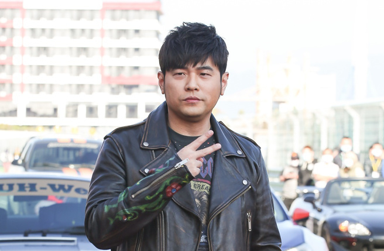

# face
A comprehensive collection of face AI models with integrated pre and post-processing steps, utilizing NVIDIA Triton Inference Server for seamless inference. This repository aims to provide easy-to-use face detection, recognition, and analysis tools.

## Table of Contents
- [Introduction](#introduction)
- [Features](#features)
- [Installation](#installation)
- [Usage](#usage)
- [Available Models](#available-models)
- [Pre and Post Processing](#pre-and-post-processing)
- [Disclaimer](#disclaimer)
- [License](#license)

## Introduction
This repository contains a suite of face AI models designed for various applications, such as face detection, recognition, and analysis. The models are optimized for performance and ease of use, leveraging NVIDIA Triton Inference Server for scalable and efficient inference.

## Features
- <b>Diverse Collection of Models:</b> Includes models for face detection, recognition, age estimation, feature embedding, and landmark detection.
- <b>Integrated Pre and Post-Processing:</b>  Ensures consistent and accurate results across different models.
- <b>Triton Inference Server Integration:</b>  Facilitates efficient and scalable model deployment.
- <b>Easy-to-Use Interface:</b>  Simple API for quick integration into various applications.

## Installation
1. Clone the Repository:

    ```bash
    git clone https://github.com/dev6699/face.git
    cd face
    ```

2. Open the repository in vscode devcontainer.

3. Download and Prepare Models:
    - Navigate to the [Available Models](#available-models) section to find the download links for each model.
    - Download each model and rename the file to `model.onnx`.
    - Place each `model.onnx` file into its respective directory within the model_repository folder.
    - Example: Setting up the YOLOFace model:

        ```bash
        mkdir -p model_repository/yoloface/1
        wget -O model_repository/yoloface/1/model.onnx <model_url>
        ```
        Ensure to replace <model_url> with the actual URL provided in the [Available Models](#available-models) section.

## Usage
1. Start Triton Inference Server:

    ```bash
    docker-compose up tritonserver
    ```

## Available Models
### 2DFAN4 for Landmark 68 Detection
- Model Name: [2dfan4](model/2dfan4/2dfan4.go)
- Description: Detects 68 facial landmarks for detailed facial analysis and alignment.
- Download Link: [Download 2DFAN4 Model](https://github.com/facefusion/facefusion-assets/releases/download/models/2dfan4.onnx)

    

### ArcFace for Feature Embedding
- Model Name: [arcface_w600k_r50](model/arcface/arcface.go)
- Description: Generates feature embeddings for faces, useful for identity verification and facial recognition tasks.
- Download Link: [Download ArcFace Model](https://github.com/facefusion/facefusion-assets/releases/download/models/arcface_w600k_r50.onnx)

    *Cosine distance of arcface embedding*
    | Source\Target |  |  |  |
    | :-----: | :-: | :---: | :-----: | 
    |  | 0.00 | 0.29 | 0.48 |
    |  | 0.29 | 0.00 | 0.45 |
    |  | 0.48 | 0.45 | 0.00 |

### Face Occluder Detection
- Model Name: [face_occluder](model/faceoccluder/faceoccluder.go)
- Description: Detects parts of a face that are not occluded by objects, providing insights into visible facial features.
- Download Link: [Download Face Occluder Model](https://github.com/facefusion/facefusion-assets/releases/download/models/face_occluder.onnx)

    
    

### Gender and Age Estimation
- Model Name: [gender_age](model/genderage/genderage.go)
- Description: Detects gender and estimates the age of detected faces.
- Download Link: [Download Gender and Age Estimation Model](https://github.com/facefusion/facefusion-assets/releases/download/models/yoloface_8n.onnx)

    

### YOLOFace
- Model Name: [yoloface](model/yoloface/yoloface.go)
- Description: Detects face bounding boxes and the 5 key facial landmarks (landmark5) using the YOLO architecture.
- Download Link: [Download YOLOFace Model](https://github.com/facefusion/facefusion-assets/releases/download/models/yoloface_8n.onnx)

    

## Pre and Post Processing
### Pre-processing
Each model has specific pre-processing steps to ensure accurate results. Common steps include:

- <b>Resizing:</b> Scaling the input image to the required dimensions.
- <b>Normalization:</b> Adjusting pixel values to a standard range.
- <b>Face Alignment:</b> Aligning faces for consistent feature extraction.

### Post-processing
Post-processing varies by model and typically includes:

- <b>Bounding Box Extraction:</b> Extracting face locations from detection models.
- <b>Feature Extraction:</b> Computing facial features for recognition models.
- <b>Label Assignment:</b> Assigning predicted labels or scores.

## Disclaimer
Model assets are subject to their individual licenses. Ensure that you review and comply with the specific license terms for each model you use. The repository does not grant rights to use third-party models beyond the scope defined in their respective licenses.

## License
This project is licensed under the MIT License - see the [LICENSE](LICENSE) file for details.
