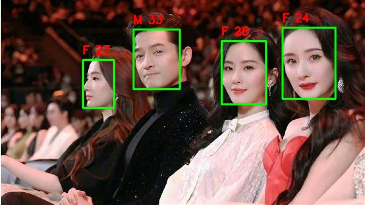

## Gender age detection



---
Model description 
[Get model](https://github.com/facefusion/facefusion-assets/releases/download/models/gender_age.onnx)
```
{
  "name": "gender_age",
  "versions": [
    "1"
  ],
  "platform": "onnxruntime_onnx",
  "inputs": [
    {
      "name": "data",
      "datatype": "FP32",
      "shape": [
        -1,
        3,
        96,
        96
      ]
    }
  ],
  "outputs": [
    {
      "name": "fc1",
      "datatype": "FP32",
      "shape": [
        1,
        3
      ]
    }
  ]
}
```