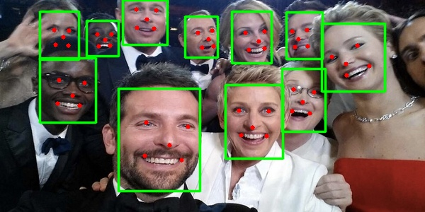

## Yoloface with face landmark5 detection



---
Model description 
[Get model](https://github.com/facefusion/facefusion-assets/releases/download/models/yoloface_8n.onnx)
```
{
  "name": "yoloface",
  "versions": [
    "1"
  ],
  "platform": "onnxruntime_onnx",
  "inputs": [
    {
      "name": "images",
      "datatype": "FP32",
      "shape": [
        1,
        3,
        640,
        640
      ]
    }
  ],
  "outputs": [
    {
      "name": "output0",
      "datatype": "FP32",
      "shape": [
        1,
        20,
        8400
      ]
    }
  ]
}
```


